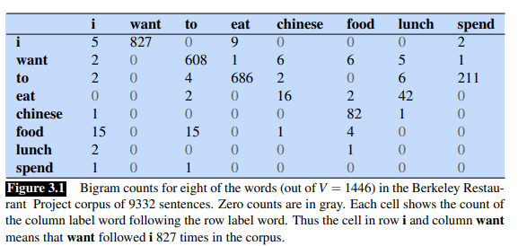
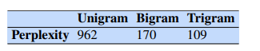
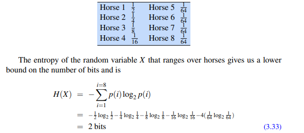

# N-gram Language Models

A language model is a ML model that predicts upcoming words. More formally, it assigns a **probability** to each possible next word or gives a **probability distribution** over the next possible words.

An **n-gram** is a sequence of n words.

Eg. Bigram => sequence of 2 words

Eg. Trigram => sequence of 3 words

## N-Grams

We also call **n-gram** a probabilistic model that can estimate the probability of word given the n-1 previous words.

So how do we estimate the probability of a word $w$ given some history $h$?

- Estimating probability from relative frequency counts.
    - Out of the times we saw history $h$, how many times was it followed by the word $w$

$$
P(w|h) = \frac{C(h,w)}{C(h)}
$$

Thus, if given large enough data, we could compute these 2 counts and estimate the probability. But even the entire web is not enough to give us good estimates for counts of entire sentences. This is because **LANGUAGE is CREATIVE**, new sentences are made all the time, thus counting is too tedious and inefficient

Need better way to estimate the probability of word $w$ given history $h$

Firstly, how do we compute probabilities of entire sequence $P(w_1, w_2, w_3, \, . . . \,  w_n)$

We can decompose this probability using the chain rule of probability

$$
P(w_{1:n}) = P(w_1) P(w_2 | w_1) P(w_3 | w_{1:2}) \, . . . \, P(w_n | w_{1:n-1}) = \prod_{k=1}^n P(w_k | w_{1:k-1})
$$

This chain rule shows the link between computing the joint probability of a sequence and computing the conditional probability of a word given previous words.

## Markov Assumption

The intuition of n-gram models is that instead of computing the probability of a word given it's entire history, we can **approximate** the history by just using the last few words.

Eg. The bigram model approximates the probability of a word given all the previous words $P(w_n | w_{1:n-1})$ by using only the conditional probability given by previous word $P(w_n | w_{n-1})$, thereby making the approximation

$$
P ( w_n | w_{1:n-1}) \approx P (w_n | w_{n-1})
$$

So the probability of entire sequence can also be computed using

$$
P(w_{1:n}) \approx \prod_{k=1}^n P(w_k | w_{k-1})
$$

The assumption that probability of a word depends only on the previous word is called **MARKOV assumption**

We can thus generalize this bigram concept to the trigram and thus to the **n-gram**

To formalize this, Let $N$ be the size of n-gram (N=2 is bigram).

$$
P ( w_n | w_{1:n-1}) \approx P (w_n | w_{n-N+1:n-1})
$$

This leaves us back to same question

## How to estimate probabilites?

One intuitive way => **Maximum Likelihood Estimation (MLE)**

- Get counts from the corpus, and normalize them so they can lie between 0 and 1.

So the bigram probability of $w_n$ given a previous word $w_{n-1}$ can be written as:

$$
P(w_n | w_{n-1}) = \frac {C (w_{n-1} w_n)} {\sum_w C(w_{n-1} w)} = \frac {C (w_{n-1} w_n)} {C(w_{n-1})}
$$

We simplify the above equation since the sum of all bigram counts that start with a given word $w_{n-1}$ is the same as the unigram counts for the word $w_{n-1}$.

We also need to augment each sentence with a special symbol <s> at the beginning of the sentence to give us bigram context of the word, we also need an end symbol </s>. 

We need the end symbol to make the bigram grammar a true probability distribution, without the end symbol, instead of the sentence probabilities of all sentences summing to 1, the sentence probabilities for all sentences of a *given length* would sum to 1, this model would define an infinite set of probability distributions, with one distribution per sentence length

Thus, for a general case of MLE n-gram parameter estimation:

$$
P(w_n | w_{n-N+1 : n-1}) = \frac {C (w_{n-N+1:n-1} w_n)} {C(w_{n-N+1:n-1})}
$$

This n-gram probability calculated by dividing the observed frequency of a particular sequence by observed frequency of a prefix. This ratio is called **Relative Frequency**

This use of relative frequencies as a way to estimate probabilities is an example of MLE, the resulting parameter set maximizes the likelihood of a training set T given a model M or P(T | M)

In bigram models, the probabilities is already very sparse and it gets even more sparse as the length of n-gram increases.

## Dealing with Scale.

Language model probabilities are always stored and computed in log space as **LOG PROBABILITIES**

Because probabilites (by definition) are less than or equal to 1, so more probabilities we multiply together, the smaller the product becomes, this would eventually lead to numerical underflow

Thus, by converting into log space, we transform this multiplication to addition, this leads to results that are not as small.

We do all computation in log space, and in the end convert it back by taking the exponent of the sum

$$
p1 \times p2 \times \ p3 = exp(log \, p1 + log \, p2 + log \, p3)
$$

There have been a lot of work done to use n-grams at scale

1. Infini-gram project
- Avoid precomputing the n-gram probability tables, instead, n-gram probabilities with arbitrary n are computed quickly at inference by using efficient representation called **suffix arrays**

2. KenLM
- Use sorted arrays and merge sort to efficiently build the probability tables in a minimal number of passes through a large corpus.

## Evaluating Language Models

Best Way: Embed the language model into an application and measure how much the application improves, this is called **Extrinsic Evaluation**, it's the only way to know if a particular improvement in a language model is really going to help the task at hand.

Unfortunately, this is very expensive for big NLP systems, thus **Intrinsic Evaluation** needed ==> **PERPLEXITY**

Before evaluation, we need to have atleast 3 distinct datasets, **training set**, **testing set** and **development set**
Logic similar to traditional ML/DL systems

Train Set: Learn the parameters of the model

Test Set: Evaluate the model

Dev Set: Test on Dev Set till the very end to update weights

### Perplexity

We evaluate language models based on which one assigns higher probability to the test set.

A better model is better at predicting upcoming words, and so it will be **LESS SURPRISED** (i.e assign a higher probability to) by each word when it occurs in the test set.

We do not often use raw probabilities to evaluating language models because

- Probability of a test set (or any sequence) depends on the nuber of tokens in it. So probability of test set gets smaller as its length increases.

Thus a per-word metric normalized by length needed ==> **PERPLEXITY**

Perplexity of a language model on a test set is the inverse probability of the test set normalized by the number of tokens.

Thus for a test set $W = w_1 w_2 \, ... \, w_n$

$$
perplexity(W) = P(w_1 w_2 \, ... \, w_n)^{- \frac{1}{n}} = \sqrt[n]{\frac{1}{P(w_1 w_2 \, ... \, w_n)}} = \sqrt[n]{\prod_{i=1}^n \frac{1}{P(w_i | w_{1:i-1})}}
$$

Thus, the higher the probability of the word sequence, lower the perplexity.

LOWER PERPLEXITY ==> BETTER MODEL

Minimizing Perplexity <==> Maximizing Test Set Probability

But WHY does perplexity use *inverse probability*

- Inverse arises from the original defintion of perplexity from cross-entropy rate in information theory (covered later)

For a n-gram, since there is end of sentence and beginning of sequence token, we include one token per sentence in our count of n.

- If we use both \<s> and \</s>, we include only the </s> token in our count of n, this is because the \</s> token is almost always followed by \<s> token (probability = 1), so we don't want the probability of the fake transition to influence our perplexity.

Perplexity is a function of both the **text** and the **language model**, thus given a text W, different language models will have different perplexities.

The above image makes it clear that, the more information the n-gram provides us about the word sequence, the higher the probability the n-gram will assign to the string

So the trigram is less surprised than a unigram because it has better idea of what words might come next, so it assigns them higher probability, and higher the probability, lower the perplexity.

Perplexity of 2 models is only comparable if they use identical vocabularies.

Improvement in Perplexity does not nessecarily mean an inprovement in the downstream task it is being trained for.

### Perplexity as Weighted Average Branching Factor

The branching factor of a language is the number of possible next words that can follow any word.

Eg. A language where any word can follow any word and vocabulary is {red, blue, green}, the branching factor here is 3.

Let's make this a language model, each word can follow every other word with probability $\frac{1}{3}$, let's suppose it was trained on a training set which has equal counts of all three colors

Let the test set be "red red red red blue", Perplexity of this language model on this test set becomes:

$$
PPL = P(red red red red blue)^{-\frac{1}{5}} = ((\frac{1}{3})^5)^{-\frac{1}{5}} = (\frac{1}{3})^-1 = 3
$$

Now let's suppose, the training set was biased towards red, P(red) = 0.8 and remaining 2 is 0.1

So obviously the perplexity for this model on this data will be lower $\approx 1.89$

Thus although the branching factor is 3, the perplexity or the weighted average branching factor is smaller

> What if a word doesn't occur in training set, but pops up in test set ==> It's fine as NLP algorithms are run not on words but on subword tokens, eg BPE, so any word can be modelled as a sequence of subwords.

## Smoothing, Interpolation and Backoff

Problem with MLE for probabilities:

- Any finite training corpus will be missing some perfectly acceptable english word, or even suppose the word occur but the exact phrase never occur.

- These unseen sequences or **zeros** cause problem for 2 reasons:
    - Their presence mean we are underestimating the probability of word sequences that might occur which hurts the performance of any application
    - Probability of any word in the test set is 0, so the probability of whole test set is 0, so since perplexity is the inverse of probability, if probability is 0, perplexity can't be computed.

Solution: **Smoothing** or **Discounting**

### Laplace Smoothing

Simplest way: Add 1 to all n-gram counts, before normalizing, so the zeros become ones. 

Even though this doesn't work well enough in practice, it laid foundation for several emerging ideas

Take unigram case, the probability of any word is $P(w_i) = \frac{c_i}{N}$, But laplace smoothing merely adds 1 to each count, so the numerator must be added with 1, and denominator must be updated with +V (size of vocabulary), since count of each word in vocabulary is increased by 1.

$$
P_{laplace}(w_i) = \frac{c_i + 1}{N + V}
$$

Similarly the bigram probability becomes

$$
P_{laplace}(w_n | w_{n-1}) = \frac{C(w_{n-1} w_n) + 1}{C(w_{n-1}) + V} = \frac{C^*(w_{n-1} w_n)}{C(w_{n-1})}
$$

An interesting useful visualization technique is to reconstruct an **adjusted count matrix** so we can see how much a smoothing algorithm changes the original counts.

This adjusted count $C^*$ is the count that, if divided by $C(w_{n-1})$ would result in smoothened probability.

Reconstructing to solve $C^*(w_{n-1} w_n)$

$$
C^*(w_{n-1} w_n) = \frac {[C(w_{n-1} w_n) + 1] \times C(w_{n-1})}{C(w_{n-1}) + V}
$$

The discount ratio becomes ratio between new and old counts.

In this case, there is sharp change in counts because too much probability mass is moved to all the zeros.

### Add K smoothing

Instead of adding 1 to each count, we add a fractional count K (0.5, 0.01).

$$
P_{laplace}(w_n | w_{n-1}) = \frac{C(w_{n-1} w_n) + k}{C(w_{n-1}) + kV}
$$

How to chose this k ==> optimize on devset.

Although this works well on text classification and other tasks, it is still not good enough for language modelling

### Language Model Interpolation

This is an alternative way of handling the **unseen sequences** or **zeros**

Eg. If we are trying to compute the trigram probability $P(w_n | w_{n-2} w_{n-1}) $, but we have not examples of the trigram $w_{n-2} w_{n-1} w_n$, we can instead estimate its probability by using the bigram probability $P(w_n | w_{n-1}) $, Similarly if we don't have the counts to compute this, we can look to the unigram $P(w_n)$

Thus, somethimes **less context can help us generalize more** for contexts that the model hasn't learned about.

Common way to use this n-gram hierarchy is **INTERPOLATION**  ==> computing a new probability by interpolating (weighting and combining) the trigram, bigram and unigram probabilities.

$$
\tilde P (w_n | w_{n-2} w_{n-1}) = \lambda_1 P(w_n) + \lambda_2 P (w_n | w_{n-1}) + \lambda_3 P (w_n | w_{n-2} w_{n-1})
$$

The $\lambda_s$ must sum to 1, equivalent to weighted average.

Each $\lambda$ is calculated by conditioning on the context, that way if we have particularly accurate count for particular bigram, we assume that the trigram counts based on this bigram will be more trustworthy, so we can give the trigram more wieght in the interpolation.

How do we calculate $\lambda s$

- Use Held-Out corpus (additional training corpus)
- EM algorithm is one iterative way to find optimal set of $\lambda s$

### Stupid Backoff

Alternative to Interpolation.

So if an n-gram has zero counts, we approximate it by backing off to the (n-1) gram, we continue backing off till we reach a history that has some counts.

For a backoff model to give correct probability distribution, we have to **discount** the higher order n-grams to save some probability mass for the lower order n-grams.

Instead of discount, it's much more common to use a **non discounted backoff algorith** ==> Stupid Backoff

Stupid Backoff gives up the idea to make the language model a true probability distribution. There is NO DISCOUNTING of the higher order n-grams

So, if a higher order n-gram has zero counts, we simply backoff to a lowe order n-gram weighted by a fixed (context independent) weight.

$S(w_i | w_{i-N+1:i-1}) = \{ \frac{count(w_{i-N+1:i})}{count(w_{i-N+1:i-1})}$ if $count(w_{i-N+1:i}) > 0$ else $\lambda S(w_i | w_{i-N+2:i-1})$

This backoff terminates in the unigram which has score $S(w) = \frac{count(w)}{N}$

Studies found that value of 0.4 worked well for $\lambda$

## Perplexity Relation to Entropy

Entropy is a measure of information

Given a random variable X ranging over whatever we are predicting (words, letters, etc), the set of which we will call $\mathcal{X}$ and wiht a particular probability function, call it $p(x)$, the entropy of X is

$$
H(X) = - \sum_{x \isin \mathcal{X}} p(x) log_2 \, p(x)
$$

Can be calculated with any base, log base 2 means the resulting value of entropy will be measured in bits

Entropy can also be thought as  lower bound on the number of bits it would take to encode a certain decision or piece of information in the optimal coding scheme.

Eg. Suppose we want to send a message to a bookie to tell him which horses to bet on

One way is to use binray representation, so for 8 horses, it becomes a 3 bit representation

Can we do better??

What if we represent horses as the actual distribution of the bets places

Until now we computed entropy to be a single variable, But most of what we will use entropy for involves sequences. 

For sequence of length n on language L

$$
H(w_1, w_2, w_3 \, ... \, w_n) = - \sum_{w_{1:n} \isin L} P(w_{1:n}) log \, P(w_{1:n})
$$

We could define this entropy to be per-word

$$
 \frac {1}{n} H(w_1, w_2, w_3 \, ... \, w_n) = - \frac{1}{n} \sum_{w_{1:n} \isin L} P(w_{1:n}) log \, P(w_{1:n})
$$

But to measure true entropy of a language, we need to consider sequences of infinite length.

$$
H(L) = lim_{n -> \infty} \frac{1}{n} H(w_{1:n}) = - lim_{n -> \infty} \frac{1}{n} \sum_{W \isin L} P(w_{1:n}) log \, P(w_{1:n})
$$

The Shannon-McMillan-Breiman theorom states that if the language is regular in certain ways (to be exact, if it is both
**stationary** and **ergodic**),

$$
H(L) =  lim_{n -> \infty} -\frac{1}{n} log \, P(w_{1:n})
$$

That is, we can take a single  sequence that is long enough instead of summing over all possible sequences. 

Intuition is that a long-enough sequence of words will contain in it many other shorter sequences and that each of these shorter sequences will reoccur in the longer sequence according to their probabilities.

A stochastic process is stationary if probability it assigns to a sequence are invariant with respects to shift in time index.
In other words, the probability distribution for words at time t is the same as the probability distribution at time t + 1. Markov models, and hence n-grams, are stationary.

Eg. A bigram $P_i$ is only dependent on $P_{i-1}$, so if we shift our time by x, $P_{i+x}$ is still dependent on $P_{i+x-1}$

But natural language is not stationary, The probability of upcoming words can be dependent on events that were arbitrarily distant and time dependent. 

Thus our statistical models only give an approximation to the correct distributions and entropies of the natural language.

To summarize,

By making some incorrect but convenient simplifying assumptions, we can compute the entropy of some stochastic process by taking a very long sample of the output and computing its average log probability.

### Cross Entropy

Useful when we don't know the actual probability distribution p that generated some data.

It allows us to use some model m (approximation of p)

$$
H(p, m) = - lim_{n -> \infty} \frac{1}{n} \sum_{W \isin L} P(w_{1:n}) log \, m(w_{1:n})
$$

That is we draw sequences according to probability distribution p, but sum the logs of the probabilities according to m

Again following the Shannon-Mcmillan-Breimann theorom

$$
H(p, m) =  lim_{n -> \infty} -\frac{1}{n} log \, m(w_{1:n})
$$

We can thereby estimate the cross-entropy of a model on some distribution p by taking a single sequence that is long enough instead of summing over all possible sequences.

Why is this useful??

- Cross Entropy $H(p, m)$ is the upperbound to the entropy $H(p)$ for any model m

This means we can use some simplified model m to help estimate the true entropy of a sequence of symbols drawn according to probability p. The more accurate m is, the closer the cross-entropy H(p,m) will be to the true entropy H(p). Thus, the difference between H(p,m) and H(p) is a measure of how accurate a model is.

So,

Cross-entropy is defined in the limit as the length of the observed word sequence goes to infinity. We approximate this cross-entropy by relying on a (sufficiently long) sequence of fixed length. This approximation of the cross-entropy of a model
$M = P(w_i | w_{i-N+1:i-1})$ on a sequence of words W is

$$
H(W) = - \frac{1}{N} log \, P(w_{1:N})
$$

The perplexity of a model P on a sequence of words W is now formally defined as 2 raised to the power of this cross-entropy:

$$
PPL(W) = 2^{H(W)} = P (w_{1:N})^{-\frac{1}{N}} = \sqrt[n]{\frac{1}{P(w_{1:N})}}
$$

## Why Not N-grams

Large language models are based on neural networks rather than n-grams, enabling them to solve the two major problems with n-grams: 

- The number of parameters increases exponentially as the n-gram order increases
- n-grams have no way to generalize from training examples to test set examples unless they use identical words. 

Neural language models instead project words into a continuous space in which words with similar contexts have similar representations.