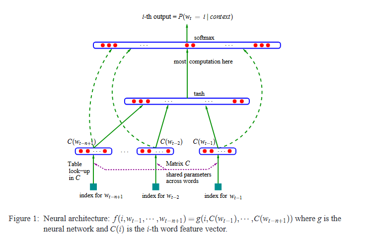

# Neural Probabilistic Language Model

## Introduction

Fundamental Problem in Language Modelling: **Curse of Dimensionality**

Eg. If one wants to model the joint distribution of 10 consecutive words in a natural language with a vocabulary V of size 100,000, there are potentially $100 000^{10} − 1$ = $10^{50} − 1$ free parameters.

**When modelling continuous variables: Easy Generalization.**

Eg. With smooth classes of functions like multi-layered neural network or GMM. 

Why? ==> Because function to be learned can be expected to have some local smoothness properties.

For discrete spaces ==> the generalization structure is not as obvious: 

- Any change of these discrete variables may have a drastic impact on the value of the function to be estimated.
- When the number of values that each discrete variable can take is large, most observed objects are almost maximally far from each other in hamming distance.

A statistical language model can be represented by the conditional probability of *next word given all the previous ones*

$$
\tilde P (w_1^T) = \prod_{t=1}^T \tilde P (w_t | w_1^{t-1})
$$

- $w_t$ is the $t$-th word
- $w_i^j$ = $w_i, w_{i+1} , . . . , w_j$

These language models, good for speech recognition, language translation and information retrieval. But improvement in LMs can significantly help.

We can reduce difficulty of modelling language models by taking advantage of word order. i.e. *temporally closer words in word sequence are statistically more dependent*

**n-gram** construct tables of conditional probabilities for the next word, for each one of a large number of contexts, i.e. combinations of the last n-1 words.

$$
\tilde P (w_t | w_1^{t-1}) \approx \tilde P (w_t | w_{t-n+1}^{t-1})
$$

Only those combinations considered which occur in training corpus, or those who occur frequently enough.

### What happens when **new combination of n words appear, that was not seen in training corpus?**

We don't want to assign 0 probability to such cases, because such new combinations are likely to occur, as no training corpora could ever be enough to contain all possible n-grams.

### **Simple Solution:**

- Look at the probability predicted using a smaller context size (**BACKOFFF**)
- Apply **SMOOTHING** or **INTERPOLATIONS**

#### **Why does this solution worked?**

Essentially a sequence of words is generated by "gluing" very short and overlapping pieces of length 1, 2, ... upto n words that have been seen frequently in training data.

Research proved SOTA at n=3, but combining various tricks can yield substantial improvements.

### **What can we improve fundamentally?**

There are 2 characteristics in the above approaches which beg to be improved upon:

1. Not taking into account contexts farther than 1 or 2 words.
2. Not taking into account the *similarity* between words.

Eg. `The cat is walking in the bedroom` in the training corpus should help us generalize to make the sentence `A dog was running in a room` almost as likely, simply because, `dog` and `cat` (and other words: the & a, room & bedroom) have **similar semantic** and grammatical roles.

## Distributed Representations: Fighting the curse of dimensionality.

Crux of the solution:

- Associate with each word in vocabulary a **distributed word feature vector**, a real valued vector in $R^m$.
- Express the joint probability function of word sequences in terms of the feature vectors of these words in the sequences.
- Learn **simultaneously** 
  - word feature vectors
  - parameters of that probability function

### Feature Vectors

Represents different aspects of the word:

- Each word associated with a point in the vector space
- Number of features (eg m=30,60,90) is much smaller than the size of the vocabulary (eg. 10000)

Feature vector associated to each word are **LEARNED**

But the could be initialized using prior knowledge of semantic features.

#### Probability Function

Expressed as product of conditional probabilities of the next word given the previous ones

- Eg. using a multilayer neural network to predict the next word given the previous one

This function has parameters that can be iteratively tuned in order to maximize the log likelihood of the training data or a regularized criterion (eg. weight decay penalty).

### Why does this work?

In above example, we knew ``dog`` and ``at`` played similar roles (semantically and syntactically), and similarly for ``(the, a)``, ``(bedroom, room)``,  ``(is, was)``, ``(running, walking)``.

We could naturally generalize (i.e transfer probability mass) from 

``` The cat is walking in the bedroom```

to  

```A dog was running in a room``` 

and likewise to

```The cat is running in a room``` 

and many other combinations.

In the proposed model, it will **generalize** because:

- *"similar" words* are expected to have *"similar" feature vector*
- probability function is a **smooth** function of these feature values. (thus small change in features, will induce small changes in probability (as opposed to large change as in the discrete case))

## Relations to Previous Work

### Neural Nets to model high dimensional discrete distributions

Already been found useful to learn the joint probability of $Z_1, ... , Z_n$, a set of random variables where each is possibly of a different nature. [Bengio, 2000a,b]

Here, the joint probability is decomposed as product of conditional probabilities.

$$
\tilde P (Z_1 = z_1, ..., Z_n = z_n) = \prod_i \tilde P (Z_i = z_i | g_i (Z_{i-1} = z_{i-1}, ...... , Z_1 = z_1))
$$

- where $g(\, . \,)$ is a function represented by the neural network
- The neural net has special left  to right architecture with:
    - $i$-th output block $g_i()$ computing parameters for expressing conditional distribution of $Z_i$ given the value of previous Z's in some arbitrary order.

We need to adapt above approach for **variable length data**

Important difference from our model: 
- All the $Z_i$ refer to the same type of object (a word).
- This model therefore introduces a sharing of parameters over time i.e.
   - The same $g_i$ is used across time and across input words at different positions.

### Neural Networks for Language Modelling

Its not new either [Miikkulainen, Dyer 1991]

But here, we push this idea to **large scale**.

We concentrate on learning a statistical model of distribution of word sequences

rather than

learning the role of words in a sentence.

Past research were limited to next character predictions, or limiting the model to capture unigram or bigram statistics.

### Discovering Similarities between words to obtain generalization

Not new, previous approaches are based on clustering of the words:

- Each word is associated deterministically or probabilistically with a discrete class, and words in same class are similar in some respect.

Our model, instead of characterizing the similarity with a discrete random or deterministic variable, we use **continuous real vector** i.e a  learned distribution feature vector to represent similarity between words.

### Vector Space representations for word

Well exploited in the area of information retrieval.
- Feature vectors for words are learned on basis of their probability co-occurring in the same documents

Important difference:
- We look for representation for words that is helpful in representing compactly the probability distribution of the word sequences from natural language text.

## Neural Model



Training set: $w_1, ...., w_T$ of words, $w_T \in V$ where  V is finite vocabulary.

Objective: Learn a good model $f(w_t, ..., w_{t-n+1}) = \tilde P (w_t | w_1^{t-1})$

Constraint: For any $w_1^{t-1}$, $\sum_{i=1}^{|V|} f(i, w_{t-1}, .... , w_{t-n+1}) = 1$, with f > 0

By this we can obtain a model of the joint probability of the sequence of words.

### Probability Function

Decompose $f(w_t, ..., w_{t-n+1}) = \tilde P (w_t | w_1^{t-1})$ into 2 parts:

- A mapping C from any element i of V to a real vector $C(i) \in R^m$ ==> distributed feature vectors associated with each word in the vocabulary. 
  - In practice, C is represented by $|V| \times m$ matrix of *free parameters*
- Probability Function over words, expressed with C ==> a function g **maps an input sequence of feature vectors for words in context $(C(w_{t-n+1}), ...., C(w_{t-1}))$, to a conditional probability distribution over words in V for the next word $w_t$. **
  - Output of g is a vector whose $i$-th element estimates the probability $\tilde P (w_t = i | w_1^{t-1})$

$$
f(i, w_{t-1}, . . . ., w_{t-n+1}) = g(i, C(w_{t-1}), . . ., C(w_{t-n+1}))
$$

Function f is a composition of these 2 mappings: C & g being *shared* across all the words in the context.

With each of these parts ate some associated parameters:

- The parameters of the mapping C are simply the feature vectors themselves, represented by $|V| \times m$ matrix C whose row i is the feature vector for C(i) for word i.
- The function g may be implemented by a feed-forward or a recurrent neural network or any other parameterized function, with parameters $\omega$.

Thus the overall parameter set is $\theta = (C, \omega)$

### Training and Analysis

Training is achieved by looking for $\theta$ that maximizes the training corpus penalized log likelihood.

$$
L = \frac{1}{T} \sum_t log \, f(w_t, w_{t-1}, . . . ., w_{t-n+1} ; \theta) + R(\theta)
$$

where $R(\theta)$ is a regularization term. (in practice, usually weight decay penalty only applied to weights of neural network and to C matrix, not the biases).

In this model:

- Number of free parameters only scales linearly with V , the number of words in the vocabulary.
- It also only scales linearly with the order n : the scaling factor could be reduced to sub-linear if more sharing structure were introduced, e.g. using a time-delay neural network or a recurrent neural network (or a combination of both).

Most experiments:

- The neural network has one hidden layer beyond the word features mapping, and optionally, direct connections from the word features to the output.
- Therefore there are really two hidden layers: 
  - the shared word features layer C, which has no non-linearity (it would not add anything useful)
  - the ordinary hyperbolic tangent hidden layer.
- More precisely, the neural network computes the following function, with a softmax output layer, which guarantees positive probabilities summing to 1

$$
\tilde P (w_t | w_{t-1} , . . . , w_{t-n+1}) = \frac {e^{yw_t}} {\sum_i e^{y_i}}
$$

The $y_i$ are the unnormalized log-probabilities for each output word i, computed as follows:

$$
y = b + Wx + U \, tanh(d + Hx)
$$

where:

- the hyperbolic tangent is applied *element by element*
- W is optionally 0, (no direct connections)
- x is the word features layer activation vector, which is the concatenation of the input word features from the matrix C

$$
x = (C(w_{t-1}), C(w_{t-2}), ......, C(w_{t-n+1})).
$$

Let h be the number of hidden units and m be the number of features associated with each word.

When no direct connections from word features to outputs are desired, the matrix W is set  to 0.

The free parameters of the model are the 

- output biases b (with |V| elements)
- hidden layer biases d (with h elements)
- the hidden-to-output weights U (a |V| x h matrix)
- word features to output weights W (a |V| x (n-1)m matrix)
- hidden layer weights H ( a h x (n-1)m matrix)
- word features C (|V| x m matrix)

$$
\theta = (b,d,W,U,H,C)
$$

The number of free parameters is $|V| (1 + nm + h) + h(1 + (n-1)m)$. 

- The dominating tactor is the first term of the sum.

In theory, if there is a weight decay on the weights W and H but not on C, the W and H could converge towards **zero** while C would **blow up** ==> Observed on training with Stochastic Gradient Acent.

Stochastic Gradient Ascent would look something like:

$$
\theta = \theta + \epsilon \frac {\partial log \tilde P (w_t | w_{t-1}, .... w_{t-n+1})} {\partial \theta} 
$$
- $\epsilon is LR$

> A large fraction of the parameters needs not be updated or visited after each example: the word features C( j) of all words j that do not occur in the input window.

**Mixture of Models**

Experiments found improved performance by combining the probability predictions of the neural network with those of an interpolated trigram model, either with a simple fixed weight of 0.5, a learned weight (maximum likelihood on the validation set) or a set of weights that are conditional on the frequency of the context (using the same procedure that combines trigram, bigram, and unigram in the interpolated trigram, which is a mixture).

## Parallel Implementation

Although parameters scale: 

- linearly with the size of input window
- linearly with the size of vocabulary

The amount of computation required for obtaining the output probabilities is  *much greater* than that required for n-gram models.

Reason: 

- In n-gram, obtaining particular probability does not require computation of the probabilities for all the words in the vocabulary, because of the easy normalization.
- Main bottleneck with neural models is the computation of the activations at output layer.

Hence Parallel processing **needed**

### Data Parallel Processing

In case of shared-memory processor, parallelization is easily achieved, thanks to the very low communication overhead between processors, through the shared memory. 

Thus, data parallel implementation:

- each processor works on a different subset of the data.
- So, each computes gradients and performs SGD updates, but if kept synchronized, it was worse, as each subset waited for all to get over before updating weights
- Thus **asynchronous implementation** where each processor can write at any time in the shared-memory area.
  - This causes some noise due to lost updates and overwrites, but this noise is minimal and does not affect training.

Reality: large shared-memory parallel computers are very expensive and their processor speed tends to lag behind mainstream CPUs that can be connected in clusters.

### Parameter Parallel Processing

If parallel computer is network of CPUs: not affordable to frequently exchange parameters among processor on a local network.

Thus ==> parallelize across parameters, in particular: **output unit parameters**, as this is where most work is done.

- large shared-memory parallel computers are very expensive and their processor speed tends to lag behind mainstream CPUs that can be connected in clusters.
  - This allowed for parallelized SGD
- CPUs essentially need to communicate two informations:
  - the normalization factor of the output softmax
  - he gradients on the hidden layer (denoted a below) and word feature layer (denoted x)

## Alternative Variant: Energy Minimization

In previous model:

- The distributed word features are used only for the “input” words and not for the “output” word (next word).
- A very large number of parameters (the majority) are expanded in the output layer: the semantic or syntactic similarities between output words are not exploited.

Here:

- The output word is also represented by its feature vector.
- The network takes in input a sub-sequence of words (mapped to their feature vectors) and outputs an energy function E which is low when the words form a likely sub-sequence, high when it is unlikely.

$$
E (w_{t-n+1}, ..., w_t) = v \, tanh*d + Hx) + \sum_{i=0}^{n-1} b_{w_{t-i}}
$$

- b: biases (correspond to unconditional probabilities
- d: vector of hidden units biases
- v: output weight vector
- H: hidden layer weight matrix

Unlike previous model input and output both correspond to x:

$$
x = (C(w_t), C(w_{t-1}), ..., C(w_{t-n+1}))
$$

The energy function can be interpreted as an unnormalized log-probability for the joint occurrence of the sequence $(w_{t-n+1}, ...., w_t)$

To obtain a conditional probability $\tilde P (w_t | w_{t-n+1}^{t-1})$, it is enough (but costly) to normalize over the possible values of $w_t$ as follows:

$$
\tilde P (w_t | W_{t-1}, ..., w_{t-n+1}) = \frac {e^{-E(w_{t-n+1}, .... , w_t)}} { \sum_i e^{-E(w_{t-n+1}, ....., w_{t-1}, i})}
$$

> Total amount of computation is comparable to the architecture presented earlier, and the number of parameters can also be matched if the v parameter is indexed by the identity of the target word $w_t$.
>
> $b_{w_t}$ remains after the above softmax normalization (any linear function of the $w_{t-i}$ for i>0 is cancelled by softmax normalization)

In this framework: the hidden units can be seen as the experts

- The joint probability of the sub-sequence $(w_{t-n+1}, ...., w_t)$ is proportional to the exponential of a sum of terms associated with each hidden unit j, $v_j tanh(d_j + H_j x)$

> we have chosen to decompose the probability of a whole sequence in terms of conditional probabilities for each element,the computation of the gradient is tractable. 

### Out of Vocabulary words

An advantage of this architecture over the previous one is that it can easily deal with out-of-vocabulary words (and even assign them a probability!).

Main Idea:

- First guess an initial feature vector for such a word, by taking a weighted convex combination of the feature vectors of other words that could have occurred in the same context, with weights proportional to their conditional probability. 
- Suppose network assigned a probability $\tilde P (i | w_{t-n+1}^{t-1})$ to words $i \in V$ in context $w_{t-n+1}^{t-1}$ , and that in this context, we observe a new word j which is not in vocabulary
  - We can then incorporate j in V and re-compute probabilities for this slightly larger set (which only requires a renormalization for all the words, except for word i, which requires a pass through the neural network)
  - This feature vector C(i) can then be used in the input context part when we try to predict the probabilities of words that follow word i.

